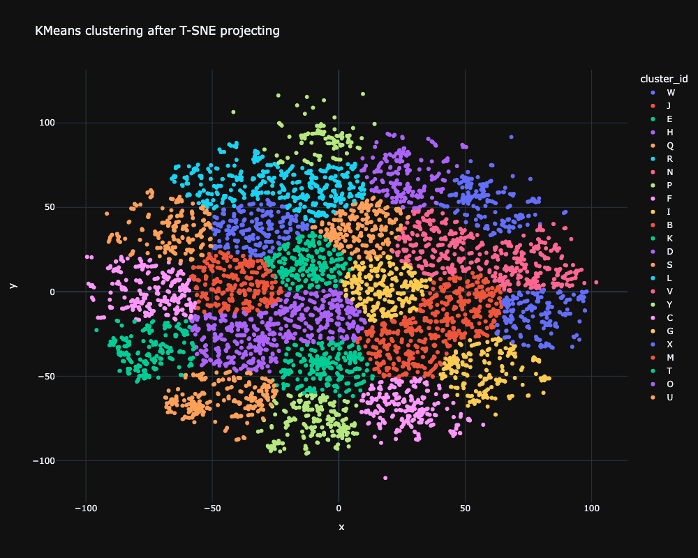

# Project Overview

## Data Source

The dataset was sourced from [Kaggle](https://www.kaggle.com/datasets/pavellexyr/the-reddit-climate-change-dataset), comprising all Reddit posts and comments that mentioned "climate" and "change" up to September 1, 2022.

## Embedding Logic

For local model execution, we utilized Ollama with the "all-minilm" embedding model due to limited computing resources. The first 10,000 comments from the dataset were transformed into embeddings using the script located in `embeddings_code/transformer.py`.

```python
ollama_embedding = OllamaEmbedding(
    model_name="all-minilm",
    base_url="http://localhost:11434",
    ollama_additional_kwargs={"mirostat": 0},
)

The embeddings were stored in `data/train_embeddings.npy`.

### Future Considerations

We plan to lease a high-performance server for processing the remaining comments into embeddings. A more precise model, such as Mistral, may also be considered.

## Clustering

Clustering functionality is implemented in `src/clustering_core/`. The `KmeansND.hpp` file contains the KMeansND class, which handles reading, writing, k-means clustering, and other functionalities imported from `src/clustering_core/modules`. This structure adheres to the S.O.L.I.D principles.

Each function within KMeansND, as well as KMeansND itself, is tested in `src/tests_core/`. Comprehensive documentation is available in the `documentation/` directory.

### Clustering Algorithm Examples
- 
- 

#### Note

Clustering prior to applying t-SNE may appear unclear, but ideally, it enhances accuracy. Nonetheless, clustering in a space with 500+ dimensions is computationally intensive and time-consuming.

## GUI Development

**This section is pending implementation.** The framework selection for the GUI is still under consideration. Planned features include:

- Identifying the most prevalent opinions within specific time frames.
- Generating interactive 2D scatter plots with t-SNE.
- Assigning new comments to clusters.
- Displaying neighboring clusters for new comments.
- Naming clusters using LLM models (e.g., Mistral).
- Providing detailed information about each cluster, such as size and commonalities.
- Showcasing the top 10 comments for each cluster, sorted by position and upvotes.
- Creating plots for data and clusters, highlighting popular, unpopular, and controversial comments.

## Optimization Strategies

Managing 28 million comments on standard computers poses a significant challenge. Our strategy involves using algorithms or Large Language Models to highlight interesting comments from each cluster, avoiding the need to visualize all comments. We also plan to facilitate the addition of new user comments into the dataset without requiring local LLM execution.

# Getting Started

## Setting Up Python Virtual Environment

To set up a Python virtual environment for Torch, models, etc., execute:

```
python3 -m venv env
source env/bin/activate
```

Then, install all dependencies:

```
pip install -r requirements.txt
```

## Running the Embedding LLM

Download [Ollama](https://ollama.com/download/mac) and follow the setup instructions. Ensure Ollama is initialized before running the embedding algorithm.

## Installing G-Tests

To install G-Tests, follow these [instructions](https://stackoverflow.com/questions/15852631/how-to-install-gtest-on-mac-os-x-with-homebrew). Future updates will include proper, portable usage (e.g., built-in CMake files).
```
